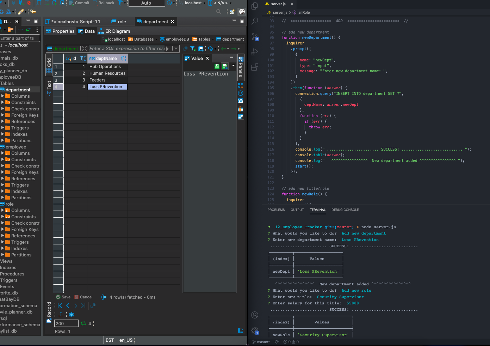
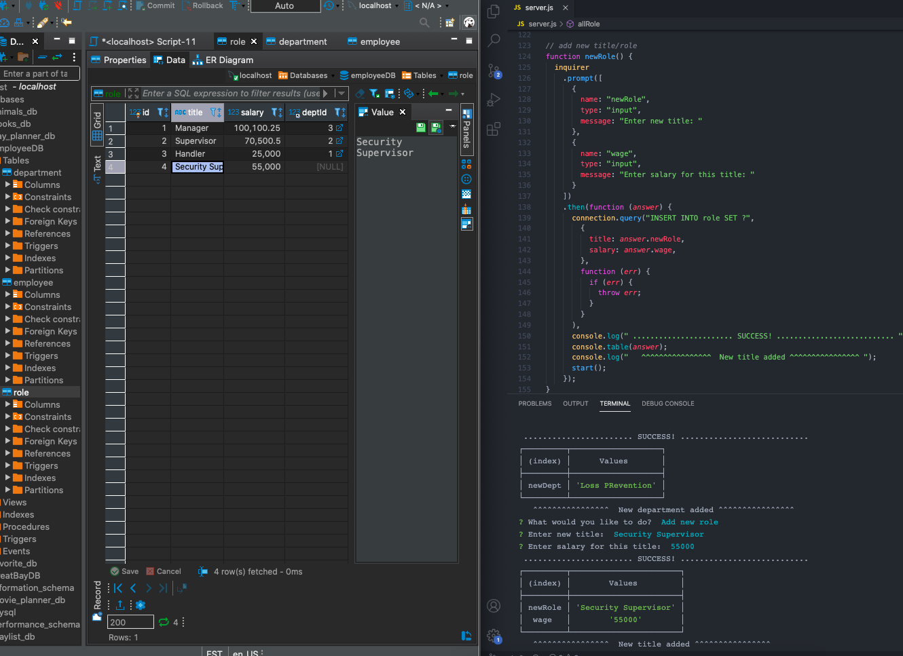
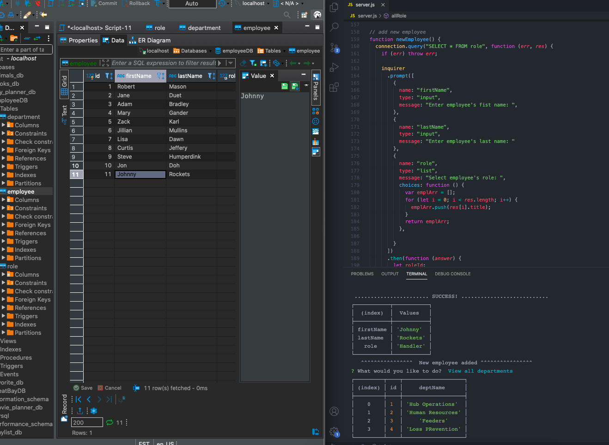
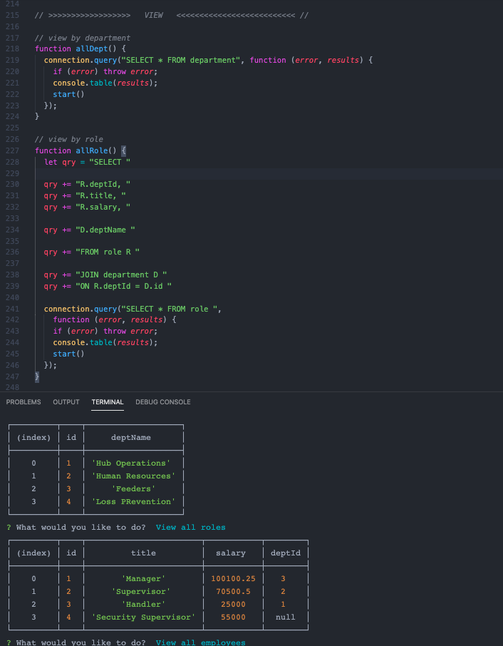
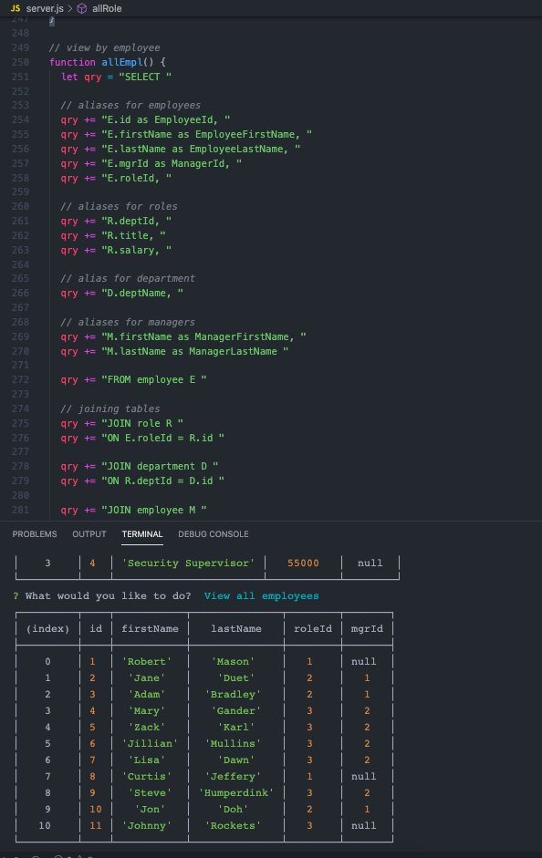
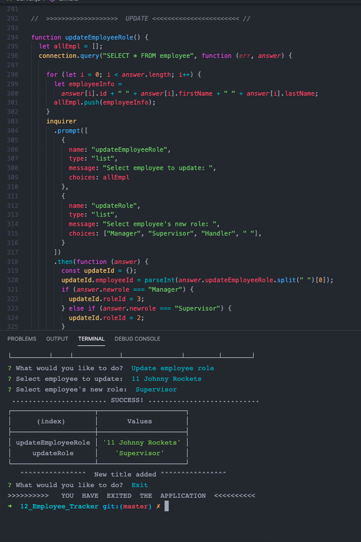
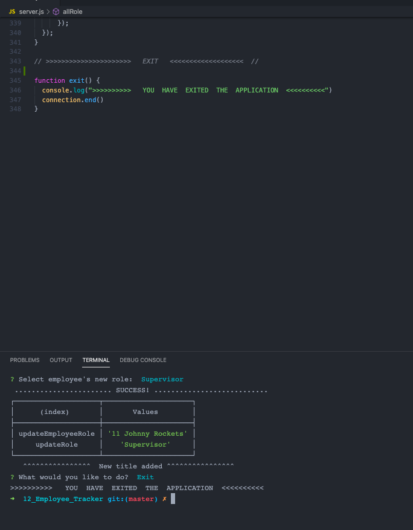
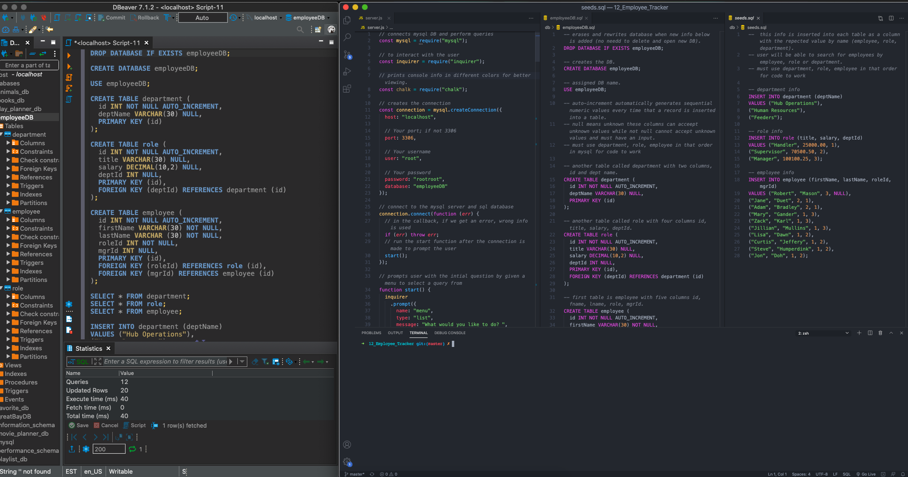

# Employee Tracker  

Employee Tracker

## Overview

A solution for managing a company's employees by role, department, along with salary info using node, inquirer, and MySQL.

## Table of Contents:

- [Links](#Links)
- [Screenshots_and_GIFs](#Screenshots_and_GIFs)
- [Motivation](#Motivation)
- [Installation](#Installation)
- [How_to_use](#How_to_use)
- [Benefit](#Benefit)
- [License](#License)
- [Tests](#Tests)
- [Contribute](#Contribute)

## Links

- [GitHub pages readme](https://jmeggles.github.io/Employee_Tracker/)
- [View the code](https://github.com/jmeggles/Employee_Tracker)

## Screenshots_and_GIFs

- 
- 
- 
- 
- 
- 
- 
- 
- 
- 
- 
- 
- 

## Motivation

As a business owner I want to be able to view and manage the departments, roles, and employees in my company so that I can organize and plan my business. This can be used to create a database for any business or inventory control or any project that needs organization and quick reliable searches.

## Installation

 

- DBeaver
- MySQL
- Control.Table
- Express
- Inquirer
- Chalk
- JavScript
- Node.Js

## How_to_use

Clone repo from guthub and intall node modules, inquirer, console.table, mysql, and chalk (optional) inside project folder. OPen DBeaver, a database, and use along with code to allow app to function proeperly and save information to the database for storage. Use 'node server.js' in terminal to activate project. Follow prompts to view employee info.

## Benefit

Anyone can benefit from this project from business owners to stay at home moms and dads. It can be used to organize any information for quick searches such as employees and thier department info including salary, to collectibles using serial numbers and date of purchase. The information can easily be adjusted to suit any project.

## License

MIT

## Tests

Testing was not done prior to start of project. However, DBeaver, console.log, and node server.js were used as each line of code was being built to ensure quaility along the process.

## Contact

For comments and/or questions, contact Jody Eggleston via
[Linkedin](https://www.linkedin.com/in/jody-eggleston/).

© Copyright 2020
